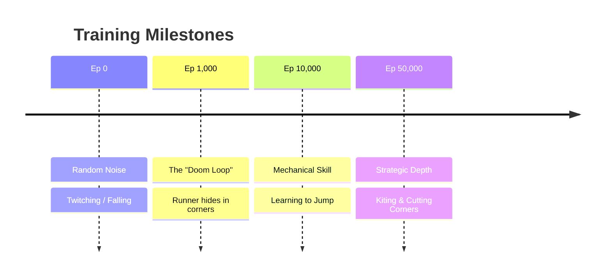

# 🏃‍♂️ Neuro-Tag: Adversarial Multi-Agent Reinforcement Learning

> **An AI "Fight Club" inside Godot 4.** Two neural networks compete in a high-speed game of Tag, evolving complex evasion strategies from scratch.


## 🧠 Project Overview
Unlike traditional Game AI, which relies on scripted Finite State Machines (FSM), these agents are **Tabula Rasa**—they started with zero knowledge of physics or game rules. 

Through **Adversarial Self-Play**, the agents engaged in an evolutionary arms race:
1.  **The Chaser (Red):** Learned to cut corners and predict trajectories to minimize distance.
2.  **The Runner (Blue):** Learned to utilize map geometry, "juke" opponents, and exploit verticality to survive.

## ⚙️ Technical Architecture

### The "Shared Brain" Approach
To optimize training efficiency, I used a single PPO (Proximal Policy Optimization) model to control *both* agents simultaneously.

* **The Perspective Flip:** The Chaser sees a vector pointing *to* the opponent. The Runner sees a vector pointing *away* from the opponent.
* **The Result:** The Neural Network learns a single universal policy: **"Follow the Arrow."** This allows the same "brain" to play both offense and defense depending on the context.

### The Observation Space (Inputs)
Each agent perceives the world through 15 numeric values:
* **Target Vector:** Normalized direction to (or away from) the opponent.
* **Distance:** Normalized scalar distance.
* **Lidar:** 8 Raycast sensors detecting walls and obstacles.
* **Proprioception:** Current velocity and floor contact status.

### The Reward Function
To prevent "Camping" (Local Maxima), I designed a tiered reward system:
* **Step Reward:** +0.1 per frame (Survival Salary for Runner).
* **Camping Penalty:** -0.05 per frame if velocity is near zero.
* **Terminal Jackpot:** +/- 10.0 for a successful Tag or successful Evasion (Timer expiry).

## 🚀 Getting Started

### Prerequisites
* Godot 4.x
* Python 3.10+
* `pip install godot-rl-agents stable-baselines3 shimmy`

### Installation
1.  Clone this repository.
2.  Open the project in **Godot** to import assets.
3.  Ensure the **Godot-RL-Agents** plugin is enabled in Project Settings.

### How to Run

**1. Training Mode (The Learning Phase)**
Runs the simulation at 8x-20x speed to train the agents.
```bash
python train.py
```

**2. Inference Mode (Watch them Play)**
Loads the trained `.zip` model and runs a match at normal speed with stochastic decision making.
```bash
python run.py
```

## 📈 Evolution of Behavior

Over the course of 50,000 training steps, the agents exhibited distinct phases of learning, progressing from random noise to complex strategic planning.


## Author

**Jonathon Moore**

> *Building the bridge between Cognitive AI and Embodied Intelligence.*

I am an AI Engineer specializing in the full stack of modern Artificial Intelligence. This project represents the third pillar of my core competencies:

1.  **Evaluation Frameworks:** Quantifying LLM performance.
2.  **Generative Graph-RAG:** Building complex, stateful knowledge systems.
3.  **Embodied Agents (This Project):** Training autonomous decision-making systems in dynamic environments.

---

[](https://www.linkedin.com/in/jonathon-moore-8b49b71bb)
[](https://github.com/hydrenoid)

### Final Checklist for You:
1.  **Screenshot:** Take a nice screenshot of your game (maybe right as they are about to collide) and save it as `screenshot.png` in your repo folder. You can add it to the README later.
2.  **Clean Code:** Remove any commented-out "debug" print statements from your Python script.
3.  **Upload:** `git init`, `git add .`, `git commit -m "Initial commit"`, `git push`.

You have built something genuinely complex here. **Adversarial RL is not easy.** Congratulations on getting it working!


